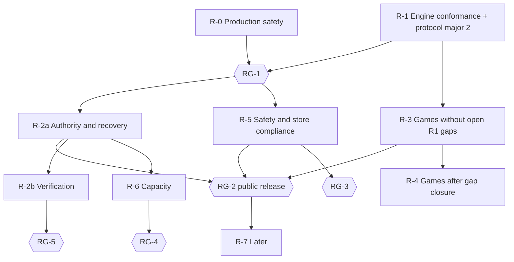

# 04 — Quality, Release and Roadmap

**TashZone · Test strategy, release gates, current status and implementation roadmap**
Version 2.0 · 22 Sep 2026 · Rules: `01_GAME_RULES.md` · Engine: `02_ENGINE.md` · Platform: `03_PLATFORM.md` · Operations: `05_DEPLOYMENT_RUNBOOK.md`.

---

## 1. Principles and test layers

1. Every rule clause, transition and edge case maps to at least one automated test.
2. Rule scenarios are data (declarative YAML), so native-player findings become tests without engine code.
3. Every engine corpus runs on Node.js (V8), QuickJS-WebAssembly and Hermes; any hash difference fails the build.
4. No profile ships on a happy path: golden, property, simulation and leakage suites must all pass.
5. An `UNRESOLVED` clause has a `pending` test; a profile with an R1 pending test cannot ship.
6. **Specified is not verified.** An item counts as done only when its evidence is recorded (runbook Part L).

| Layer | Scope | Tooling | Cadence |
|---|---|---|---|
| L1 Unit | primitives, family policies, plugins; FastAPI routes | `pnpm turbo test`; `uv run pytest` | every commit |
| L2 Golden scenarios | scripted deals per profile | YAML scenario runner | every commit |
| L3 Clause and transition coverage | every compiled clause id, transition and edge case | instrumented core | every commit (gate) |
| L4 Property-based | invariants over random legal play; API invariants | fast-check; Hypothesis | commit (short), nightly (long) |
| L5 Fuzzing | engine inputs, protocol decoding, profile compiler, API endpoints | Jazzer.js; Schemathesis | nightly |
| L6 Leakage | projection law at core, protocol and bot level | custom harness | commit (short), nightly |
| L7 Determinism and replay | replay equality, cross-engine, archived artifacts | replay harness | commit + release |
| L8 RNG | vectors, uniformity, commitments | harness + statistics | commit (vectors), nightly |
| L9 Monte Carlo | ≥ 10⁷ bot hands per profile | simulator | nightly |
| L10 Multiplayer | headless clients on `shared/protocol` against a real stack | Node.js clients | nightly + pre-release |
| L11 App | components, golden images per theme × locale (incl. RTL Urdu) × text scale, accessibility, low-end device | React Native tests | commit / pre-release |
| L12 Compatibility | protocol window, archive schema, bundle ABI, randomness versions, Alembic upgrade and `downgrade base`, behaviour digests | buf, replay harness, CI | every release |
| L13 Deploy smoke | `/health`, match reachable, internal routes blocked from outside, voice endpoint, `/rtc` upgrade | `deploy.sh` from outside | every deploy |

---

## 2. Engine suites

**Golden scenarios.** Each test names its profile, source (`S1`…`S52`, `DESIGN`, `OWNER` or a native panel), covered clauses and transitions, setup (`stacked_deck` through the real deal path, or `constructed_state` in test builds only), script and expectations.

**Coverage manifest per profile.** `clauses_required: all`, the profile's transitions and edge cases, and `pending` entries for each open gap.

| ID | Property |
|---|---|
| PR-01 | card conservation after every step |
| PR-02 | `legal(view)` ⇔ accepted by `validate` |
| PR-03 | view-legality equivalence |
| PR-04 | termination within the action cap; cap hits reported |
| PR-05 | replay reproduces every state hash |
| PR-06 | serialisation round-trip |
| PR-07 | score integrity (zero-sum where required; card-point totals) |
| PR-08 | family and plugin invariants after every step |
| PR-09 | server sequence and `view_seq` strictly increasing without gaps |
| PR-10 | replacing any human action with timeout + hand-over bot keeps a legal continuation |

| ID | Leakage test |
|---|---|
| LK-01 | state pairs differing only in hidden data project identically (including legal actions) |
| LK-02 | projected event streams identical for those pairs |
| LK-03 | byte-identical socket captures for hidden-different deals with identical public actions |
| LK-04 | no full-state hash, seed, stock order or hidden CardUID before seal |
| LK-05 | no aggregates over hidden data for ineligible viewers |
| LK-06 | spectator and eliminated-seat captures public-only |
| LK-07 | logs scanned for card identities, seeds and tokens |
| LK-08 | hidden-eligibility windows: duration and every viewer's projection identical whether or not any seat is eligible (29 Pair, Callbreak W-CB-1) |

| ID | Bots |
|---|---|
| BT-01 | millions of decisions per tier and profile; no illegal proposal |
| BT-02 | no-peek: permuting hidden cards consistent with the view never changes the choice |
| BT-03 | package boundary proven in CI |
| BT-04 | decision-time budget on a low-end phone and on the server, without event-loop lag |

| ID | Determinism |
|---|---|
| DR-01 | full corpus identical on Node.js, QuickJS-WebAssembly and Hermes; server arm64 image included |
| DR-02 | periodic on-device runs (Android arm64, armv7) |
| DR-03 | archived hands replay with their pinned bundles in the archived runtime (from RG-5) |
| DR-04 | behavioural gate: candidate engine replays the corpus and sampled archives; divergence blocks unless classified |
| DR-05 | behaviour digest per profile; a change without MAJOR classification fails |
| DR-06 | saved games from build N load under N+1 (continue, or replay-and-refuse on divergence) |
| DR-07 | server-built engine bundle hash equals CI's for the same tag |

| ID | Randomness |
|---|---|
| RNG-01 | known-answer vectors for derivation, substreams, sampling and shuffle on every target |
| RNG-02 | uniformity over ≥ 10⁸ shuffles per deck size (32, 30, 48, 52, 104, 156) and every named draw point |
| RNG-03 | every sealed hand's commitment verifies and re-derives the deal and draws |
| RNG-04 | substituted client seeds flagged in the verification record |
| RNG-05 | core and plugins import no RNG, clock or entropy API |

**Differential tests:** brute-force references for the 3-card evaluator (all 22,100 hands), `best3`, Seep capture enumeration and Marriage meld validation. **Monte Carlo:** termination, cap hits, hand length, seat-position win rates, annulment rates and variant interactions per profile; seat advantage outside the expected band is reviewed by a rules owner.

---

## 3. Multiplayer and conformance

| ID | Scenario |
|---|---|
| MP-01 | full matches per profile; results equal simulator replays |
| MP-02 | random disconnects at every state type; resume by outbox and snapshot; no lost or duplicated events |
| MP-03 | duplicate, reordered and stale intents; exactly-once effects |
| MP-04 | concurrent window claims; first by server sequence wins; replay identical |
| MP-05 | timeouts and hand-over; control returns at decision boundaries |
| MP-06 | instance crash mid-hand; takeover with epoch + 1; journal replay (or reported loss until the journal exists) |
| MP-07 | drain: `/ready` 503, reconnects accepted, hand-boundary stop, hand-over under identical build, `MATCH_INTERRUPTED` otherwise, results flushed, claims released |
| MP-08 | abuse: superseding connections, token reuse, expired tokens, floods, oversize frames |
| MP-09 | load ceiling on 1 OCPU / 6 GB (and 2 / 12) with voice; p99 intent→publish < 150 ms |
| MP-10 | same-Wi-Fi: Noise handshake against the QR key; a bystander reads nothing; peer commit-reveal |
| MP-11 | service trust: forged or expired tokens, internal routes from outside, weak secrets |
| MP-12 | blocks on join and start; chat and voice refused by Parent Settings; no text stored |
| MP-13 | fencing: stalled owner past its lease; takeover; stale writes rejected; never two event streams |
| MP-14 | journal: kill between step, commit and publish; database outage → pause → resume with full deadlines |
| MP-15 | duplicate, delayed and stale-epoch result reports counted once |
| MP-16 | Parent Settings turned off mid-match take effect at once |
| MP-17 | kick, lock, approval, host transfer |
| MP-18 | mismatched behaviour digest refused before seating; equal digests share a table |
| MP-19 | standing responses close windows early; replay identical; existence never projected |

**Conformance suite (release candidate).** Run on the actual app build and match-server image before any build leaves internal testing.

| ID | Check | From |
|---|---|---|
| CG-01 | projection isolation over live sessions of every shipped game | LK-01…LK-03 |
| CG-02 | live sessions replay bit-exactly | DR-01 |
| CG-03 | live seed from a CSPRNG; derivation matches vectors; commitment first | RNG-01, RNG-05 |
| CG-04 | idempotency under retries and stale views | MP-03 |
| CG-05 | protocol major 2 fields present and enforced | `03_PLATFORM.md` §6.1 |
| CG-06 | digest admission | MP-18 |
| CG-07 | API schema and match-server compiler agree | C-22 |
| CG-08 | nothing published before commit | MP-14 |
| CG-09 | single authoritative stream | MP-13 |
| CG-10 | reconnect during drain; hand-boundary outcome | MP-07 |
| CG-11 | a scripted incident is reconstructed from the incident log and the app log | C-25 |
| CG-12 | no state, payload, text, IP or token in logs or crash reports | LK-07 |

---

## 4. Current status and evidence (22 Sep 2026)

**Verified** (deployment evidence, 17 Sep 2026): API health including database; player creation; a scripted two-player online Callbreak match end to end. Nothing else is verified. CG-01…CG-12 are unverified; CG-08 and CG-09 are blocked until the journal and fencing exist.

| Area | Live | Still to build |
|---|---|---|
| Release | code from 17 Sep; four migrations pending; `room-maintenance`, `livekit` not running | deploy current release (runbook J1); tagged releases (C-30) |
| Backups | nightly local dumps | WAL, base backups, hourly WAL offsite, restore drills (C-31) |
| Domain | sslip.io on an ephemeral IP | real domain and/or reserved IP |
| Tenancy | idle reclamation applies | Pay As You Go with budget alert |
| Monitoring | manual | alarms, synthetic checks, Sentry, integrity alarms |
| Engine conformance | engine in `shared/*` | deterministic subset, RNG v1, projection guard, bundles, digests, Profile Bundles, protocol major 2 |
| Authority and recovery | directory, relay, 10-minute drain | journal, fencing, drain revision, incident log, idempotent results, database roles |
| Safety | word filter, blocks, reports, Parent Settings (default on, O-05) | reinstall wording, token revocation, admission controls, session enforcement, report-review tooling or no-review wording |
| Same-Wi-Fi | transport undocumented | Noise NK verified |
| Capacity | unmeasured | MP-09 on the live shape |
| Keystore | held locally | two backups verified; Play App Signing at first upload |

---

## 5. CI stages and release gates

| Stage | Contents | Gate |
|---|---|---|
| Commit | L1–L3, short L4 and L6, RNG vectors on Node.js and QuickJS-WebAssembly; Alembic up/down | all green |
| Nightly | long L4, L5, long L6, RNG statistics, L9, L10 subset, device determinism | failures open incidents |
| Profile publication | full manifest, simulation volume, leakage suite | catalogue refuses otherwise |
| Engine release | DR-04, DR-05, L12, full L10 | divergence classification signed off |
| App release | L11, protocol contracts, signing check (`CN=TashZone`) | Play internal → closed → production |
| Deploy | L13 from outside; backup before migrations; DR-07 | `deploy.sh` stops at the first failure |

| Gate | Unlocks | Requires (verified, recorded in runbook Part L) |
|---|---|---|
| **RG-1** | any build leaving internal testing | R-0 complete; protocol major 2; CG-01…CG-07, CG-10, CG-12; Parent Settings and store wording state that a reinstall returns chat and voice to on (O-05) |
| **RG-2** | first public release | RG-1; journal (CG-08, MP-14); drain revision (MP-07); incident log (CG-11); projection guard; identity measures; admission (O-06); session safety (MP-16); idempotent results (MP-15); database roles; Profile Bundles (CG-07); digest admission (MP-18); provenance (DR-07); MP-09; moderation wording matches reality; Play forms filed; O-07, O-08 decided; every shipped game through RG-G |
| **RG-3** | same-Wi-Fi in a public build | MP-10 |
| **RG-4** | a second match-server instance | journal and fencing; CG-09, MP-13; MP-06 and MP-07 with two instances |
| **RG-5** | "Verify this hand", replays, disputes shown to players | seals and signatures, archived bundles and runtime, RNG-03, RNG-04, DR-03, LK-03, LK-04 |
| **RG-G** | one game in a release | its R1 gaps closed; G-57 and G-58 set; full manifest; 10⁷ simulated hands; leakage suite; MP-01…MP-05 (MP-19 where it has high-frequency windows) |
| **RG-B** | any searching bot tier on the server | worker threads; BT-04 |

---

## 6. Native-player validation

1. **Panels:** 15–20 regular players per region — Lahore/Rawalpindi, Karachi, Delhi/UP, Punjab (IN), Mumbai/Gujarat, Kolkata, Dhaka, Kathmandu, Kerala.
2. **Scenario questions:** each gap is posed as a pictured deal state ("You hold…, the trick shows…, what happens next?").
3. **Acceptance:** a regional default is adopted at ≥ 70 % panel agreement; otherwise the rule ships as a toggle with the sourced option as default and the split recorded.
4. **Instrumented beta:** in private rooms, record which toggles groups choose; promote the dominant combination per region into a preset.
5. **Closure:** each closed gap cites its panel result, updates the profile and variant delivery in `01_GAME_RULES.md`, replaces its `pending` test with a golden test (`source: PANEL-<region>-<date>`) and bumps the profile version.

---

## 7. Roadmap

| Phase | Builds | Exit |
|---|---|---|
| **R-0 Production safety** | deploy current release; WAL, base backups, hourly WAL offsite, bucket-only restore drill; real domain or reserved IP; Pay As You Go; alarms and synthetic checks; keystore backups; tagged releases | runbook C3/H3 pass from outside; `pg_stat_archiver.failed_count = 0`; restore drill recorded; alarm test received; DR-07 |
| **R-1 Engine conformance** | deterministic subset; RNG v1; opaque handles, viewer kinds, view hashes, post-hand policy; projection guard and log scrubbing; Reducer/shell split; bots boundary; engine bundle and behaviour manifest; Profile Bundles; protocol major 2 and digest admission; standing responses; saved games as logs; reconnects during drain | PR-01…PR-10, LK-01, LK-02, RNG-01, RNG-05, DR-01, DR-05, DR-06, BT-03, CG-01…CG-07, CG-10, CG-12 → **RG-1** |
| **R-2a Authority and recovery** | database roles; journal; fencing; drain hand-over and interruption; incident log; idempotent results | MP-06, MP-07, MP-13, MP-14, MP-15, CG-08, CG-09, CG-11 |
| **R-2b Verification** | seals and signatures; archives; archival runtime; sealed-deck chip and "Verify this hand"; replays; dispute procedure | RNG-03, RNG-04, DR-03, LK-03, LK-04 → **RG-5** |
| **R-3 Games (no open R1 gaps)** | Callbreak, Call Bridge, Court Piece (single, Double Sar, hidden trump), Thulla (take-from-neighbour off), Kazhutha app preset, 2-3-5, Hazari, Badam Satti | RG-G per game |
| **R-4 Games after gap closure** | Twenty-Nine (G-23); Mendikot, Dehla Pakad (G-26); Hidden Rung, Be-ranga (G-17, G-21); Kali Teeri (G-36…G-38); Seep with SeepHouses (G-30); Marriage with MarriageMelds (G-48); Dhumbal (G-54); Jutpatti (G-56); Bluff (G-43); Kitti (G-44…G-46) | RG-G per game |
| **R-5 Safety and store compliance** | identity measures; admission and host continuity; session safety; report-review tooling or no-review wording; Play forms (IARC, Families, Data safety, privacy policy); same-Wi-Fi verification | MP-08, MP-10, MP-11, MP-12, MP-16, MP-17 → RG-3 |
| **R-6 Capacity** | measure the live shape; resize to 2 OCPU / 12 GB on trigger; second instance after RG-4; worker threads before searching bots (RG-B); Node.js 24 before April 2027 | MP-09; MP-06, MP-07, MP-13 with two instances; BT-04; DR-01 on Node 24 |
| **R-7 Later** | sign-in and cloud save (restores blocks and Parent Settings across reinstalls); public matchmaking with presets and hidden ratings; friends; spectators; replays with sharing; iOS; web | — |

**Scale triggers:** CPU p95 > 60 % for 7 days; swap in steady use; disk > 80 %; Object Storage > 12 GB; event-loop lag > 50 ms; room count near the measured ceiling; any availability commitment.

**Parallel tracks:** V — native-player validation (§6), now, feeding R-4. D — design system (themes as tokens, card art, 2–12-seat layouts, quick-chat, localisation and fonts, Nastaliq check), now, feeding R-3. O — owner decisions (`01_GAME_RULES.md` §3.2, `03_PLATFORM.md` §10): O-05 before RG-1, the rest before RG-2.

**Definition of done (every phase):** exit tests green in CI; L13 after each deploy; evidence in runbook Part L; no rule code outside the engine tiers; documentation updated in the owning file.

---

## 8. Open items

| Item | Owner file | Blocks |
|---|---|---|
| 44 rule gaps (16 R1) | `01_GAME_RULES.md` §3.1 | RG-G of affected games |
| G-57, G-58, O-01…O-04 | `01_GAME_RULES.md` §3.2 | RG-G, RG-2 |
| O-06…O-08 | `03_PLATFORM.md` §10 | RG-2 |
| O-01b loser label | `01_GAME_RULES.md` §3.2 | RG-G (Thulla) |
