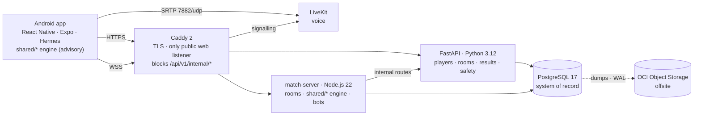

# 03 — Platform

**TashZone · Architecture, technology, data, protocol and security**
Version 2.0 · 22 Sep 2026 · Status: frozen for implementation. Engine: `02_ENGINE.md`. Tests, release gates and roadmap: `04_QUALITY_RELEASE_ROADMAP.md`. Operations: `05_DEPLOYMENT_RUNBOOK.md`.

**Status markers:** **Live** — running in production today. **Planned** — frozen design, not yet built. Verification evidence is tracked only in `04_QUALITY_RELEASE_ROADMAP.md` §4 and runbook Part L.

---

## 1. System overview

| Component | Role | State | Status |
|---|---|---|---|
| App | rendering, input, instant legal-move highlighting (same engine), offline and same-Wi-Fi tables | phone-only progression | Live |
| Caddy | TLS, routing, blocks internal routes from the internet | — | Live |
| FastAPI | players, tokens, rooms, join tokens, results, stats, blocks, reports, Parent Settings, app-config, voice tokens | stateless | Live |
| match-server | WebSocket sessions, live rooms, engine execution, bots, chat filter, room directory, relay, drain | rooms in memory | Live |
| PostgreSQL | system of record; room directory; hand journal (Planned) | durable | Live |
| room-maintenance | expiry and retention jobs | — | Live (next deploy) |
| LiveKit | voice media | memory only | Live (next deploy) |

**Hosting:** Oracle Cloud Always Free, Mumbai, one Ampere A1 VM (1 OCPU / 6 GB, 100 GB boot, 4 GB swap), Docker Compose, arm64 images built on the server. **Scaling path:** Pay As You Go with budget alert → resize to 2 OCPU / 12 GB → second match-server instance (only after fencing and the journal are verified) → separate database instance when paid capacity is justified.

---

## 2. Architecture rules

| ID | Rule | Status |
|---|---|---|
| C-01 | Rule-bearing platform logic lives in the shared **Runtime Reducer**; each host has a thin **Runtime Shell** (`02_ENGINE.md` §1) | Planned |
| C-02 | Each engine release is also a single-file ES-module bundle with no imports, stored content-addressed; its SHA-256 is `engine_build_hash`. An archived QuickJS-WebAssembly runtime for historical replay is built with the verification features | Planned |
| C-03 | Profiles compile to a canonical binary form (`profile_hash`); room toggles produce an effective profile (`effective_profile_hash`) | Planned |
| C-04 | No full-state hash, seed, stock order or hidden identity reaches a client before the hand ends; clients receive hashes of their own projection only | Live (projection) |
| C-05 | The bots package imports only view types and the engine API | Planned |
| C-06 | View-legality equivalence; the app highlights legal moves, the server validates | Planned |
| C-07 | Plugins are compiled into engine releases; profiles and presets are data; no over-the-air JavaScript updates; protocol versions negotiated | Live |
| C-08 | Table lifecycle in the Reducer inside the match server; FastAPI owns the durable room record | Live |
| C-09 | The hand input log is the source of truth and is committed before any derived event is published (`02_ENGINE.md` §3) | Planned |
| C-10 | Viewer kinds: `seat`, `handover_bot(seat)`, `spectator_public`, `eliminated_seat`, `post_hand_participant`, `admin_breakglass` (audited) | Planned |
| C-13 | Same-Wi-Fi traffic: Noise NK (X25519, ChaCha20-Poly1305) against the host key shown in a QR code; host holds full state, so never rated | Planned (existing transport unverified) |
| C-14 | **Drain:** on `SIGTERM` refuse new rooms and answer `/ready` 503; keep accepting reconnections for owned rooms; send `ServerRestarting`; play continues until `DRAIN_DEADLINE_MS` (10 min); then stop each match at its next hand boundary; hand over if the successor runs the identical engine build and the journal exists, else end `MATCH_INTERRUPTED`; flush results; release claims. `stop_grace_period` = drain deadline + `HAND_STOP_BUDGET_MS` (10 min) + 30 s | Live: refuse, notify, 10-min drain, flush. Planned: reconnects, hand boundary, hand-over |
| C-15 | FastAPI never executes rule code; searching bots run in match-server worker threads | Live (FastAPI); Planned (workers) |
| C-16 | Boot volume holds `pgdata`, `pgwal`, local backups, images; Object Storage holds only the offsite copy; APKs served by Caddy | Live |
| C-17 | Service trust: player token (HMAC) → FastAPI; join token → match server, verified without an API call; match server → FastAPI internal routes with `INTERNAL_API_TOKEN`; secrets ≥ 32 characters and distinct, checked at start | Live |
| C-18 | Each room code is claimed by exactly one match-server instance (PostgreSQL directory, lease, heartbeat, takeover); a phone landing elsewhere is relayed unread; empty `INSTANCE_URL` = single instance | Live |
| C-19 | Voice on LiveKit; media never passes Caddy or the API; FastAPI mints room-scoped, microphone-only tokens; no audio or message text stored | Live |
| C-20 | **Fencing:** claims carry an ownership epoch (PostgreSQL sequence) and a lease in database time; every journal write, renewal and result report is epoch-checked in the same transaction; an owner unable to confirm renewal before expiry minus a margin self-fences (`OWNERSHIP_LOST`). Defaults: lease 30 s, renew 10 s, margin 10 s | Planned |
| C-21 | **Identity without sign-in:** no device identifiers; random install id for registration limits only; per-player `token_generation` for revocation; registration rate-limited; new players start with chat and voice **on** (O-05, owner decision 22 Sep 2026, risk accepted in writing: a reinstall or data clear returns both to on); store declarations and the Parent Settings screen must say so | Planned |
| C-22 | **Profile Bundles:** CI compiles each profile version into compiled profile, preset hashes, a generated JSON Schema of valid toggles and metadata; CI proves schema ⇔ compiler agreement; FastAPI validates room settings against the schema; the match server re-validates and reports the effective profile hash | Planned |
| C-23 | **Compatibility admission** by behaviour digest (`02_ENGINE.md` §9) | Planned |
| C-24 | **Conformance gate:** the release candidate passes CG-01…CG-12 before leaving internal testing | Planned |
| C-25 | **Incident log:** metadata-only connection, relay, resync, delivery-checkpoint, rejection, pause, ownership and drain events with correlation ids; 30 days; never cards, text, IPs or tokens | Planned |
| C-26 | **Single writers:** roles `tz_migrate` (all DDL via Alembic), `tz_api`, `tz_match`, `tz_maint`; FastAPI owns room status; match server refuses to start on an older schema | Planned |
| C-27 | **Results** accepted once per match id, epoch-checked, statistics in the same transaction | Planned |
| C-28 | **Admission:** host kick, lock, join approval (defaults O-06); host rights pass after 60 s of host absence before the start | Planned |
| C-29 | **Session safety:** Parent Settings changes reach the match server by PostgreSQL `NOTIFY`; voice tokens 10 minutes with re-checked refresh; voice-off removes the LiveKit participant; one versioned word list in `shared/moderation` | Planned |
| C-30 | **Provenance:** deploy from annotated tags; server and CI engine bundle hashes must match; `/health` reports tag, commit and engine build | Planned |
| C-31 | **Offsite recovery:** hourly WAL bundles plus nightly dumps and weekly base backups; offsite ≤ 15 GB and ≤ 10,000 requests/month (alarms at 12 GB and 8,000) | Planned |

---

## 3. Technology stack

| Layer | Decision | Status |
|---|---|---|
| Engine | TypeScript `shared/*` (pnpm workspaces + Turborepo); deterministic subset below; esbuild single-file bundle | Live (packages); Planned (bundle) |
| Protocol | `shared/protocol`, version-negotiated; API backward-compatible with the previous version | Live |
| Records | Protobuf (protobuf-es) with buf breaking-change checks | Planned |
| Crypto | @noble/hashes, @noble/ciphers, @noble/curves; Ed25519 hand seals | Planned |
| Randomness v1 | ChaCha20 substreams, HMAC-SHA-256 derivation, rejection sampling, Fisher–Yates | Planned |
| App | React Native + Expo, Hermes; EAS Build (APK preview, AAB production) and local release builds; release keystore in `app/credentials/`; in-app update banner from `/api/v1/app-config`; deep link `tashzone://room/CODE`; LiveKit SDK; local rotating text logs + Sentry (Planned); fonts per script on demand (Planned) | Live |
| API | FastAPI, Python 3.12, uv, psycopg 3, SQLAlchemy/Alembic (`api-migrate` before `api`); OpenAPI off in production; per-process rate limits; Python `jsonschema` for Profile Bundle validation (Planned) | Live |
| Match server | Node.js 22 (Node.js 24 LTS before April 2027), TypeScript, WebSocket on 8787 | Live |
| Database | PostgreSQL 17 (arm64), volumes `pgdata`, `pgwal` | Live |
| Voice | LiveKit v1, 7880 internal, 7882/udp media, 7881/tcp fallback, no TURN unless devices fail | Live (next deploy) |
| Edge | Caddy 2 (80, 443/tcp, 443/udp) | Live |
| Firewalls | OCI security list + host iptables above the final REJECT; never ufw | Live |
| Monitoring | OCI instance monitoring and alarms, APM synthetic checks, Sentry | Planned |

**Deterministic TypeScript subset (engine packages):** integers within ±2³¹; no `Math.random`, `Date`, timers, `Intl`, locale functions or transcendental `Math`; no `for…in` or object-key iteration in rule logic; sorting only with engine comparators; hashing only through pinned libraries; bundle has zero imports and no host globals. Enforced by ESLint rules, a package allow-list and three-engine replay (Node.js, QuickJS-WebAssembly, Hermes).

---

## 4. Runtime modes

| Mode | Authority | Transport | Rating | Randomness |
|---|---|---|---|---|
| Online private rooms | match server | WSS via Caddy | none in v1.0 | server commitment + client seeds |
| Same-Wi-Fi | host phone | Noise NK over LAN | never | peer commit-reveal |
| Offline vs bots | phone | — | never | device seed |
| Replay | archived bundle | — | — | recorded |

**Bots:** fill empty seats; hand-over bots play for disconnected seats with that seat's SeatView and human-like pacing; tiers above basic require worker threads on the server.

---

## 5. Data

### 5.1 Ownership
FastAPI owns every platform table and all migrations (including the match server's tables). The match server writes only the room directory, hand journal and archive, and incident log (role `tz_match`); everything else it needs comes through internal routes or `NOTIFY`.

### 5.2 Entities
| Entity | Owner | Key fields | Retention | Status |
|---|---|---|---|---|
| Player | FastAPI | id, nickname, status, `token_generation`, deletion state | until deleted | Live (fields Planned) |
| ParentalSettings | FastAPI | `free_text`, `voice` (defaults O-05) | with player | Live |
| Block | FastAPI | two player ids; symmetric; ≤ 200 per player | with player | Live |
| Report | FastAPI | reporter, subject, room, match, reason code | 180 days | Live |
| Feedback | FastAPI | player, text | per worker setting | Live |
| Room | FastAPI | 6-character code, host (transferable), game, validated settings, status, times | expired by worker | Live |
| Room admission record | FastAPI | kicked players, lock, approval mode, host changes | with room | Planned |
| Seat | FastAPI | room, player or bot, position | with room | Live |
| Room directory claim | match server | room, instance id and URL, epoch, database-time lease, heartbeat, hand-over marker | while live | Live (epoch Planned) |
| Match | FastAPI | room, game, placements, bot seats, engine build, effective profile hash, epoch, sealed hand ids, outcome `completed \| interrupted` | kept | Live (fields Planned) |
| Stats | FastAPI | per player and game counters (online only) | with player | Live |
| Hand | match server | match, index, dealer, randomness version, commitment, encrypted seed (until seal), client seeds, chain root, signature | 90 days (longer if reported) | Planned |
| Input record | match server | `02_ENGINE.md` §3 | with hand | Planned |
| MatchState checkpoint | match server | match, hand index, bytes, digest | with hand | Planned |
| Connection event | match server | C-25 fields | 30 days | Planned |
| ProfileBundle | CI → PostgreSQL | C-22 contents | forever | Planned |
| EngineArtifact | CI → PostgreSQL | build hash, tag, commit, randomness and schema versions, behaviour manifest | forever | Planned |

**Phone only:** XP, levels, titles, table designs, offline stats, saved games, Parent PIN. Lost on reinstall until sign-in exists.

### 5.3 Persistence and recovery
| Data | Durable | Offsite | Recovery |
|---|---|---|---|
| Live table state | memory of the owning instance | — | journal replay by the next owner under the same engine build (Planned); today a crash loses the hand in progress |
| Platform data | PostgreSQL | nightly dumps (Live, local); WAL, base backups, hourly WAL bundles (Planned) | dump restore; point-in-time restore including bucket-only (≤ 1 h loss) |
| Chat, voice | never stored | — | — |

### 5.4 Versioning and pinning
A match pins `(effective_profile_hash, engine_build_hash, event_schema_version, randomness_version)` at start; it moves to another process only at a hand boundary or by recovery, and only under the identical engine build. A phone takes a seat only if its behaviour digest equals the server's.

### 5.5 Privacy
Collected: auto-registered player id and nickname, Parent Settings, room and match participation, stats, blocks, reports (reason codes), feedback. Not collected: real names, phone numbers, contacts, location, device identifiers, message text, audio, client IPs (held in memory for rate limiting only). `DELETE /players/me` deletes the player's data; if seated in a live match it completes when the match ends (≤ 24 h); archive references are anonymised.

---

## 6. Protocol

### 6.1 Invariants
1. The app sends **intents**; only the Reducer creates actions.
2. Every accepted action is journaled before any derived event is sent.
3. Each viewer receives only its projection, as a gap-free sequence numbered by `view_seq`.
4. No message contains hidden identities, pre-seal seeds or full-state hashes.
5. Order is the room's single command queue; ties broken by server sequence; wall-clock time never decides game state.
6. Intents are idempotent by `(seat, hand_id, intent_id)`.
7. Protocol major 2 fields are mandatory for every build leaving internal testing: `Intent{intent_id, hand_id, expected_view_seq}`, `ViewEvents{view_hash}`, `TableSnapshot{view_seq, view_hash}`, `Hello{engine_build_hash, behaviour_digest, correlation_id}`.
8. The app never applies predicted game state.

### 6.2 Transport
HTTPS app → Caddy → FastAPI (`/api/v1/*`); one WSS per player per room app → Caddy → match server (address from `MATCH_SERVER_URL`); schemas in `shared/protocol`; heartbeat, ~25 s silence = lost; deadlines sent as server timestamps; per-connection rate limits; oversize or malformed frames close the connection.

### 6.3 Joining
1. App → FastAPI: create or join room (player token); blocks and admission checked; returns code, join token, match-server URL and required behaviour digest.
2. App compares its own digest; on mismatch it prompts an update and does not connect.
3. App → match server: `Hello{protocol range, versionCode, engine_build_hash, behaviour_digest, correlation_id, join token, last_view_seq?}`.
4. Match server verifies the join token locally, claims the room or relays to its owner, and replies `Welcome` + `TableSnapshot`.
A second connection for a seat supersedes the first. Admission outcomes: `KICKED`, `ROOM_LOCKED`, `JOIN_PENDING_APPROVAL`.

### 6.4 Messages
| App → match server | Match server → app |
|---|---|
| `Hello`, `Ping` | `Welcome`, `Pong` |
| `Start` (host) | `TableSnapshot{view_seq, seat_view, table_meta, waiting_on, deadline, seat_controls, commitment}` |
| `Ready{hand_id, client_seed}` | `ViewEvents{from_seq, to_seq, events, view_hash, waiting_on, deadline, seat_view}` ¹ |
| `Intent{intent_id, hand_id, expected_view_seq, action}` (includes window responses and `SetStandingResponse`) | `IntentResult{intent_id, accepted, server_seq?, reject_code?}` |
| `ResumeControl` | `SeedRequest{hand_id, commitment}` · `HandSealed{hand_id, verification_record}` |
| `RequestSnapshot{reason}` | `SeatControlChanged`, `PresenceChanged`, `HostChanged` |
| `Chat{quick_chat_id or text}` | `Chat`, `TablePaused`, `TableResumed{deadline}` |
| `Leave` | `ServerRestarting{plan}`, `MatchEnded{result, outcome}`, `Error{code}` |

¹ `seat_view` (added 23 Sep 2026): the full projection after the batch. The app replaces its view with it and checks `view_hash`; `events` drive animation only. A delta-only encoding may replace it in a later minor version without changing `view_hash` semantics.

Error codes: `UPDATE_REQUIRED`, `TABLE_PAUSED`, `OWNERSHIP_LOST`, `KICKED`, `ROOM_LOCKED`, `JOIN_PENDING_APPROVAL`, `MATCH_INTERRUPTED`, `WINDOW_CLOSED`, `STALE_VIEW`.

FastAPI (HTTPS): rooms create/join; room admission (host: kick, lock, approve); `POST /api/v1/rooms/{code}/voice`; blocks, reports, Parent Settings, feedback; `GET /api/v1/app-config`; `DELETE /players/me`. Internal routes `/api/v1/internal/*` for the match server only.

### 6.4a Implementation notes (Phase 5, 23 Sep 2026)
- WebSocket path: `wss://<MATCH_DOMAIN>/match`; `/health` returns tag, commit, engine build hash and room count only; `/ready` returns 503 while draining.
- Additional error codes in `shared/protocol`: `BAD_FRAME`, `UNAUTHORIZED`, `RATE_LIMITED`, `NOT_SEATED`. Reject codes in `IntentResult`: engine codes (`BAD_SCHEMA`, `WRONG_HAND`, `NOT_NOW`, `NOT_YOUR_TURN`, `ILLEGAL_ACTION`, `MATCH_OVER`) plus `STALE_VIEW`, `TABLE_PAUSED`, `OWNERSHIP_LOST`.
- Nothing is sent to a viewer whose projection did not change, so a sealed window request produces no traffic for other seats (timing cannot leak eligibility).
- Join token: `base64url(JSON claims) "." base64url(HMAC-SHA-256(JOIN_TOKEN_SECRET, "tz/join/v1." + payload))`; claims `room, player_id, seat, name, host, free_text, exp, profile_id, preset, settings`.

### 6.5 Hand start and seeds
1. Server generates a 32-byte CSPRNG seed, persists the encrypted seed and commitment `H("tz/commit/v1" ‖ server_seed ‖ hand_id)`, then sends `SeedRequest`.
2. Apps reply `Ready{client_seed}`; after all replies or 5 s, missing seeds are substituted and flagged (bots always substituted).
3. `hand_seed = HMAC-SHA-256(server_seed, "tz/hand/v1" ‖ hand_id ‖ client seeds in seat order)`.
4. At seal the seeds, chain root and signature are revealed; any app can re-derive the deal.
5. Exact encoding (tz-rng-v1, `shared/engine/src/core/rng.ts`): every `‖` is length-prefixed framing, `u32be(len) ‖ bytes` per part; labels and hand ids are UTF-8, seeds are raw bytes. Substreams: `key = HMAC-SHA-256(hand_seed, frame("tz/draw/v1", label))`, ChaCha20 with a zero 12-byte nonce; uniform draws use 31-bit rejection sampling; shuffles are Fisher–Yates from the top. Substituted client seeds: `HMAC-SHA-256(server_seed, "tz/substitute/v1/<hand_id>/<seat>")`. The seal **signature** is not implemented yet (see `docs/IMPLEMENTATION_STATUS.md`).

### 6.6 Windows, deadlines, reconnect
- **Windows:** eligible seats see `WindowOpened`; first valid claim by server sequence wins; sealed commits revealed together; standing responses count as responses and close windows early; the next turn waits for the window.
- **Deadlines:** turn timeout → logged `Timeout` → hand-over bot; after two consecutive timeouts the seat stays in hand-over until `ResumeControl`; window timeout → logged default; after pause, recovery or hand-over the deadline restarts in full.
- **Reconnect:** new `Hello` with `last_view_seq`; relay to the owner if needed; missing events from the outbox (last 512) or a snapshot; control returns at the next decision; a draining owner accepts reconnections; after `OWNERSHIP_LOST` the app reconnects and is relayed to the new owner. App background = disconnect.
- **Consistency:** the app hashes its projection after each batch; a mismatch triggers `RequestSnapshot`.
- **Leaving:** a leaving or kicked player is replaced by a bot for the rest of the match; a kicked player cannot rejoin that room.

### 6.7 Chat and voice
- Typed messages pass the word filter in memory and are relayed; never written to the database or logs; free text only when the sender's Parent Settings allow it, enforced for the whole session; quick-chat always available; mute is local.
- Voice tokens: HS256, `sub` = player id, room-scoped, microphone-only; checked against membership and Parent Settings. Live: ~2 h lifetime. Planned: 10 minutes with refresh and LiveKit removal on voice-off. Media over 7882/udp (7881/tcp fallback); no recording.

### 6.8 Same-Wi-Fi
Host phone runs the Reducer and shell; QR code carries address, port and host static key; Noise NK transport; peer commit-reveal seeds; tables unrated and labelled "trusted table"; host leaving ends the table. May not ship in a public build until the transport is verified (RG-3).

---

## 7. Security

### 7.1 Trust zones
Untrusted: app, networks → Caddy (TLS, internal routes blocked) → server zone (FastAPI, match server, LiveKit) → PostgreSQL (never published). Firewalls: OCI security list and host iptables.

### 7.2 The app is never trusted for
Legality, turn order, randomness, winners, seat or team assignment, rules or profile values, timing, other viewers' data, or its own safety settings.

### 7.3 Threats and controls
| ID | Threat | Control | Status |
|---|---|---|---|
| T-01 | Modified app reads hidden data | only projections leave the server; server-side legality | Live |
| T-02 | Illegal actions | engine validation of every intent | Live |
| T-03/04 | Replayed or duplicated intents | TLS; intent binding and idempotency | Planned |
| T-05 | Seat hijack | player- and room-scoped join tokens; supersede | Live |
| T-06 | Forged service calls | Caddy block + `INTERNAL_API_TOKEN` | Live |
| T-07 | Weak secrets | ≥ 32 characters, distinct, startup check | Live |
| T-08 | Hidden-card leakage | defence in depth (§7.4) | Planned (full harness) |
| T-09 | Bot information leakage | SeatView only; package boundary | Planned |
| T-10/11 | RNG manipulation, fake client seeds | commitment first; HMAC derivation; substitution flagged | Planned |
| T-12 | Room guessing | 6-character codes, join limits, blocks, expiry | Live |
| T-13 | Voice abuse | membership and settings check; short tokens (Planned) | Live |
| T-15 | Harmful chat to children | word filter, block, mute, report, Parent Settings | Live |
| T-16 | Event tampering | results only via internal routes; hash chain and signed seals (Planned) | Live |
| T-17 | Denial of service | rate limits, frame caps, minimal exposure | Live |
| T-18 | Seed exposure at rest | seeds encrypted until seal | Planned |
| T-19 | Same-Wi-Fi sniffing | Noise NK | Planned |
| T-20 | SSH compromise | key-only login | Live |
| T-21 | Data loss | backup before migration; nightly dumps; WAL and offsite (Planned) | Live |
| T-22 | Update-channel tampering | HTTPS, read-only mount, SHA-256 and size, higher `version_code` only | Live |
| T-23 | Keystore loss or leak | two backups; Play App Signing | Live |
| T-24 | Supply chain | lockfiles, pinned majors, arm64 builds from source | Live |
| T-25 | Split-brain ownership | C-20 | Planned |
| T-26 | Rule skew between phones and server | C-23 | Planned |
| T-27 | Safety reset by reinstall | C-21, C-28 | Planned |
| T-28 | Stale safety state in a session | C-29 | Planned |
| T-29 | Projection bug in production | engine L-14 | Planned |
| T-30 | Untraceable deployment | C-30 | Planned |
| T-31 | Debug or state routes | engine L-16 | Planned |

### 7.4 Hidden-information defence in depth
Legality reads only the actor's view; projection is the only exit; opaque handles; no aggregates over hidden data; only the match server holds live hidden state; apps receive only their own projection hashes; rejection codes never depend on hidden data; forced-move auto-play delayed; fixed viewer kinds; logs, crash reports and the incident log carry no cards, seeds, tokens, text or IPs; runtime projection guard; post-hand concealment is presentation-only.

### 7.5 Keys, identity, operators, moderation
- **Secrets:** `/srv/tashzone/.env` (chmod 600): `PLAYER_TOKEN_SECRET`, `JOIN_TOKEN_SECRET`, `INTERNAL_API_TOKEN`, LiveKit key and secret, database password; hand-seal key (Planned). Never in git, chat or backups.
- **Identity:** players auto-register; the player token is the identity; rotating `PLAYER_TOKEN_SECRET` re-registers every app; `token_generation` revokes one player (Planned).
- **Operators:** SSH key only; no tool reads a live hand; any break-glass access is audited.
- **Moderation:** blocks symmetric (join and host start); reports store reason codes only; **no review tooling exists**, so no listing or policy may claim reports are reviewed; Parent Settings must be described as resetting on reinstall until sign-in.

---

## 8. Observability

| Signal | Live | Planned |
|---|---|---|
| Container logs | Docker JSON, 10 MB × 3 per service | structured JSON with room, match, hand, pseudonymous player |
| Health | `api /health` (database), match `/health` (rooms) and `/ready` | external synthetic checks (OCI APM) |
| Host | manual commands | OCI Monitoring alarms: CPU, memory, swap, disk > 80 %, instance stopped |
| Database | — | `pg_stat_archiver` alarm on failures |
| Backups | manual check | nightly `rclone check`; alarm if newest dump > 1 day |
| Errors | local app text logs | Sentry with scrubbing |
| Incidents | — | incident log (C-25) |
| Integrity | — | alarms on projection-guard violation, commit failure and table pause, `OWNERSHIP_LOST`, epoch-rejected writes |

**Dispute workflow (Planned):** incident log by room and correlation id → hand record → verify signature, chain and seed commitment → re-derive draws → re-execute with the pinned bundle → reconstruct each seat's view at the disputed sequence → decide.

---

## 9. Product decisions (v1.0)

| Area | Decision |
|---|---|
| Platform | Android first (APK and Google Play); iOS later from the same codebase |
| Online play | private rooms only, joined by 6-character code or `tashzone://room/CODE`; host starts; bots fill empty seats; no public matchmaking |
| Offline and same-Wi-Fi | supported; progress stays on the phone |
| Accounts | automatic registration; no sign-in or cloud save |
| Chat and voice | open to all ages, moderated rather than age-gated; on by default (O-05); Parent Settings behind a Parent PIN; nothing stored |
| Content rating | 3+; no chips, stakes or gambling imagery; no monetisation; no ad or attribution SDKs |
| Themes | dark (obsidian, gold, green felt) and light, as design tokens |
| Localisation | English, Urdu, Hindi, Nepali first; fonts downloaded per locale |
| Fairness UX | sealed-deck chip before the deal; "Verify this hand" after the hand once RG-5 passes |
| Statistics | phone (offline) and server (online) stats shown separately; leaderboards use server records only |
| Hosting | Oracle Cloud Always Free until a scale trigger fires |

---

## 10. Open items

| ID | Decision | Recommendation | Needed before |
|---|---|---|---|
| O-05 | safety defaults for a newly registered player | **Decided 22 Sep 2026: on by default; reinstall risk accepted by the owner** | — |
| O-06 | room admission defaults | lock after start on; approval on when free text or voice is on | RG-2 |
| O-07 | adoption threshold for behaviour-changing engine builds | ≥ 90 % of 7-day active installs, or a forced-update date | first such release |
| O-08 | how an interrupted match counts | neither win nor loss; shown as "interrupted" | RG-2 |
