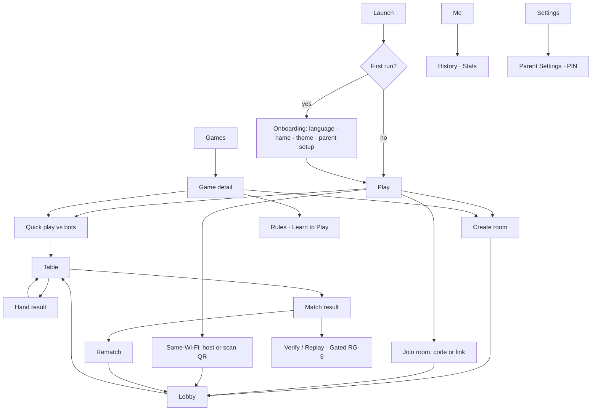

# 06 — Product and UX Blueprint

**TashZone · One card-game platform, sixteen game experiences**
Version 1.1 · 22 Sep 2026 (A-1, O-01, O-05 decided) · Status: blueprint for the mockup phase (no implementation). Authoritative inputs, in order: `01_GAME_RULES.md` → `02_ENGINE.md` → `03_PLATFORM.md` → `04_QUALITY_RELEASE_ROADMAP.md` → `05_DEPLOYMENT_RUNBOOK.md`; competitor and review evidence from `MASTER_SOUTH_ASIAN_CARD_GAMES_RESEARCH.md` §4.12, §7.3–7.4, §9.G, §11.5, Appendix A. Where this blueprint and those files disagree, those files win.

**Availability markers:** **v1.0** — in the first public release · **Gated** — waits for a named release gate (RG-x) · **Later** — roadmap R-7 · **Pending** — waits for an owner decision or rule gap.

---

## 1. Vision, principles and non-goals

**Vision.** The best place to play South Asian card games with the people you know: every game played by its real rules, every deal provably fair, every table calm, fast and readable — one product, not sixteen apps.

**Evidence the vision answers** (Play Store review mining, 2,284 negative reviews): ads covering cards (14 %), wrong scores and crashes (11 %), distrusted bots (11 %), disconnect "auto mode" lock-out (9 %), wrong rules (7 %), rigged-deal suspicion (6 %); the most-requested features are friends-first private play, match-length choice, observer mode and quick-chat (R-1…R-10). No competitor evidences verifiable shuffles; only two are multi-game with depth.

| # | Principle | What it means in the UI | Source |
|---|---|---|---|
| P1 | **The real game, visibly** | rules come from the profile, shown as generated rule cards; unresolved rules are labelled, never guessed; regional presets named by region | 01 §0, R-4 |
| P2 | **Always know what you can do** | every moment answers "whose turn, what is legal, how long" without colour alone | engine P-07, P-11 |
| P3 | **The table is sacred** | nothing ever covers the hand, trick or floor: no ads, no pop-ups over play, toasts only in safe areas | R-10, no monetisation |
| P4 | **Fairness you can see** | sealed-deck chip before the deal; "Verify this hand" after it (once RG-5); bot and hand-over guarantees stated where they act | engine P-09, §8; R-2, R-3 |
| P5 | **Interruptions are normal** | disconnects, hand-over, pauses and releases are designed states with clear recovery, not errors | engine §3, §5; platform C-14 |
| P6 | **One product grammar** | the same navigation, room, shell, controls and results in all 16 games; families add modules, never new grammars | engine C-12 tiers |
| P7 | **Premium, restrained** | mehfil obsidian, gold and green felt; 2.5D depth and physical motion that explain play; decoration never slows play | owner visual direction |
| P8 | **Safe by construction** | social features follow Parent Settings server-side; no UI path weakens them; nothing implies more than the system guarantees | platform C-21, C-29, §7.5 |

**Non-goals (v1.0):** chips, coins, bets or any gambling imagery (3+ rating); ads; public matchmaking, ratings, leaderboards, friends lists, spectating, cloud save (Later); daily-wheel or streak-bait gamification; separate visual languages per game; any UI requiring data the viewer may not know.

---

## 2. Users (behaviour-based)

| Persona | Behaviour | Needs | Designed answer |
|---|---|---|---|
| **Fluent regular** | knows one or two games deeply; plays with the same group | fast entry, own regional rules, no hand-holding | Quick Rules, named presets, one-tap room create, rematch |
| **Crossover player** | fluent in one game, new to its relative (Callbreak → 29) | map familiar concepts, spot differences | "Differences from…" panel on game detail; family coach marks |
| **Newcomer** | little card-game background | learn without a tutorial wall | Learn to Play (interactive, against bots), assists on by default |
| **Host** | creates rooms, shares codes, starts matches | control seats, settings, admission | lobby with seat map, rule summary, kick/lock/approve (Gated C-28) |
| **Interrupted player** | loses network, backgrounds the app, receives a call | return to the same seat without penalty | reconnect overlay, hand-over bot with explicit guarantee, control returns at next decision |
| **Same-Wi-Fi group** | family or friends in one place, weak internet | play with no server | host-by-QR, "trusted table" label (Gated RG-3) |
| **Parent or guardian** | configures a child's phone | control chat and voice, understand limits | Parent PIN screen, honest wording about reinstall (C-21) |
| **Observer** | watches friends play | see public play only | spectator view (Later; `spectator_public` only) |

No demographic claims are made; personas are defined by behaviour.

---

## 3. The sixteen games as families

Families come from each profile's `family` field (01). UX modules attach to families; unique mechanics are named explicitly.

| Family (engine) | Player-facing label | Games | Shared UX module | Unique interactions |
|---|---|---|---|---|
| `trick` | Trick-taking | Callbreak / Call Bridge, Court Piece (all modes), Twenty-Nine, Mindi (Mendikot, Dehla Pakad), 2-3-5, Kali Teeri | trick centre, bid/call control, trump chip, trick counters, last-trick peek | 29 auction + Pair window + indicator slot; Court Piece collection pile and streak meter; Hidden Rung ask/reveal and face-down play; 2-3-5 blind pull; Kali Teeri partner call and team reveal; Dehla Pakad mid-hand deal |
| `inflation` | Shedding and pick-up | Thulla / Bhabhi / Getaway, Kazhutha | trick centre with interrupt event, escape ribbon, growing hand | thulla/vettu interrupt animation; forced draw from waste; take-from-neighbour window (flag) |
| `capture` | Capturing | Seep | floor with houses and owner badges, capture chooser | build/cement/break house; bid on first play; baazi meter |
| `compare` | Arrange and compare | Hazari, Kitti | arrangement board, sealed "up", reveal sequence | Hazari 4-group arrangement; Kitti fold window |
| `layout` | Building on sevens | Badam Satti | four-row layout, auto-pass | pass only when no playable card |
| `claim` | Bluffing | Bluff / 420 | face-down claim pile, claim banner, challenge window | challenge resolution reveal |
| `draw_discard` | Draw and meld | Marriage, Dhumbal / Jhyap, Jutpatti | draw-from stock/discard, meld rack, discard spread | Marriage see-tiplu knowledge state and maal; Dhumbal Jhyap/show call; Jutpatti pair matching |

**Per-game treatment and status**

| Game | Seats | Rule status | Ship-blocking gaps | UX notes |
|---|---|---|---|---|
| Callbreak / Call Bridge | 4 | FROZEN_WITH_GAPS | — | integer-tenths scores shown as decimals; redeal window (see §7.6) |
| Court Piece (single, Double Sar, hidden trump, Hidden Rung, Be-ranga) | 4, pairs | FROZEN_WITH_GAPS | G-17 (Hidden Rung), G-21 (Be-ranga) | modes as presets inside one game; G-16 "who decides to continue for a 52-court" remains a rule gap, not a UX choice |
| Twenty-Nine | 4, pairs | FROZEN_WITH_GAPS | G-23 | red/black six pips as score skin |
| Mindi (Mendikot, Dehla Pakad) | 4, pairs | FROZEN_WITH_GAPS | G-26 | tens counter per team |
| 2-3-5 | 3 | FROZEN | — | quota badges; blind pull picker |
| Seep (100, 30) | 4, pairs | FROZEN_WITH_GAPS | G-30 | capture chooser must present every candidate the engine enumerates (selection rule pending G-30) |
| Hazari | 4 | FROZEN | — | forced show order animated group by group |
| Kali Teeri | 4–6, hidden teams | PROVISIONAL | G-36, G-37, G-38 | team shown as "Unknown" until revealed |
| Thulla / Bhabhi / Getaway | 3–8 | FROZEN_WITH_GAPS | — (G-01, G-02 block take-from-neighbour) | displayed as **Thulla** (O-01); Bhabhi and Getaway searchable as aliases; loser label pending O-01b |
| Kazhutha | 3–8 | FROZEN_WITH_GAPS | G-10 | which game "Kazhutha" means is unresolved: present the two profiles as region-labelled modes, neither called the default, until G-10 closes |
| Badam Satti | 3–8 | FROZEN_WITH_GAPS | — | auto-pass announced as "no playable card" |
| Bluff / 420 | 3–10 | PROVISIONAL | G-43 | challenge eligibility and leader rules pending |
| Kitti | 2–5 | PROVISIONAL | G-44, G-45, G-46 | ranking display pending run-order gap |
| Marriage | 2–5 | FROZEN_WITH_GAPS | G-48 | maal shown only to seen players |
| Dhumbal / Jhyap | 2–5 | PROVISIONAL | G-54 | call threshold shown from profile once set |
| Jutpatti | 2–4 | PROVISIONAL | G-56 | wild rule pending |

A game appears as **playable** only after its RG-G gate; PROVISIONAL games stay hidden or shown as "In development" (owner decision PD-01).

---

## 4. Information architecture

**Primary navigation** (bottom bar, four destinations; the table hides it):

| Tab | Contains |
|---|---|
| **Play** (home) | Continue (live room or saved game), Quick play vs bots, Create room, Join room, Same-Wi-Fi (Gated RG-3), recently played games |
| **Games** | catalogue, search, filters, game detail, rules, Learn to Play |
| **Me** | nickname and avatar, phone progress (XP, level, titles, table designs), history, statistics (phone and online shown separately) |
| **Settings** | appearance (theme, table quality 2.5D/3D, card style), gameplay assists, sound and haptics, language, accessibility, Parent Settings (PIN), privacy and data deletion, help, about and update |

**Contextual screens:** game detail → rules / Learn to Play / preset picker → create room; room lobby → table → hand result → match result → rematch or exit; replay and "Verify this hand" (Gated RG-5); report and block sheets; reconnect and update screens.



**Deep links:** `tashzone://room/CODE` opens Join with the code filled; if the app build is incompatible it opens the update screen first (§11).

---

## 5. Discovery and rule education

**Catalogue card:** game name (localised, with the familiar alias in small type, e.g. "Court Piece · Rang"), family label, seat range, teams or solo, availability chips (Online · Same-Wi-Fi · Offline), status chip when relevant ("In development"), favourite toggle. **Estimated duration and difficulty are not shown** until they have data: duration depends on match lengths (G-58) and difficulty tiers are editorial (PD-02).

**Browse:** families as horizontal shelves; filters by seat count, teams/solo, availability; search across names and aliases (Rang, Mendikot, Dehla Pakad, Getaway, Donkey, 420, Jhyap, Call Bridge); Recently played and Favourites (phone-local). No recommendation algorithm.

**Game detail (same structure for all 16):**
1. Hero: 2.5D table preview in that game's layout.
2. At a glance: players, teams, deck, typical flow in one sentence, availability.
3. **Quick Rules** — one screen generated from the profile: objective, deal, turn, legal-move rule, scoring, winning, key terms.
4. **Learn to Play** — interactive lesson against bots using scripted golden scenarios (engine test data reused as lessons); 3–5 steps; skippable.
5. **Differences from…** — for crossover players, a generated comparison against the nearest family member (e.g. Callbreak ↔ Twenty-Nine).
6. **Rule presets** — named by region or source; every toggle shows what it changes.
7. **Open questions** — any `UNRESOLVED` rule appears as "Varies by region — not yet settled" with its candidates, never as a chosen rule.
8. Terminology — local terms with plain meaning (Appendix A glossary; unverified terms marked for native review).

---

## 6. Interaction system

**Universal card gestures**

| Action | Primary | Alternative | Notes |
|---|---|---|---|
| Play one card | tap to lift, tap again (or **Play**) to play | drag onto the play zone | "One-tap play" setting for fluent players; drag always available |
| Select several | tap to toggle; count shown on the action button | — | Bluff claims, melds, Seep captures, arrangements |
| Reorder hand | long-press and drag | **Sort** button (suit / rank / group) | auto-sort on by default |
| Confirm group action | action bar button | — | Claim, Declare, Show, Up, Capture |
| Cancel | tap lifted card again or tap the table | back gesture | never plays a card |
| Inspect | long-press a played card or the last trick | — | last-trick peek (public data only) |

**Action bar** (above the hand): context buttons only for legal actions of this moment — Bid, Pass, Ask trump, Reveal, Declare Pair, Take, Challenge, Build, Capture, Draw stock, Take discard, Show, Jhyap, Fold, Up. A disabled button never appears for an action that is not part of the current decision.

**Confirmation policy:** confirm only irreversible, high-cost actions that a mis-tap could cause: bids and calls, trump naming, show/Jhyap, fold, challenge, arrangement "up", leaving a match. Normal card plays are protected by the lift-then-play pattern instead of dialogs.

**Feedback:** every action gets immediate local acknowledgement (card lifts, "sending" shimmer) and is committed only on the server's projection (no optimistic state, platform §6.1 rule 8). A rejected action returns the card with a one-line reason derived from the player's own view ("You must follow Hearts"); reasons never depend on hidden data (engine L-04).

---

## 7. Gameplay shell

### 7.1 Layout regions (portrait default)

```
┌───────────────────────────────────────┐
│ HUD: game · score · trump chip · menu │  top safe area
│  opponents' seats (arc)               │
│         ┌─────────────────┐           │
│         │  CENTRE ZONE    │  trick / floor / layout / pile / board
│         └─────────────────┘           │
│ status line: whose turn · what to do  │
│ window strip (when a window is open)  │
│ action bar                            │
│ own hand (fan / rack)                 │  bottom safe area
│ social dock: chat · voice · emotes    │  collapsible, never over the hand
└───────────────────────────────────────┘
```

**Seat ring:** own seat always at the bottom; opponents placed by seat order in the play direction (clockwise or counter-clockwise per profile, with a direction arrow). 2–4 seats: cross; 5–6: arc; 7–10: compact arc with smaller avatars and count badges. Partners sit opposite and share a team marker (colour plus pattern plus label "Team A/B").

**Seat plate:** avatar, nickname, card count, role badges (dealer, bidder, trump caller), bid or quota, team marker, connection state, speaking ring (voice), control state ("You", "Auto — plays for X", "Bot").

### 7.2 Turn and legality ("What can I do right now?")

| Moment | Presentation |
|---|---|
| Your turn | status line "Your turn — play a Heart" (or "any card"); timer ring on your seat; legal cards **lifted with a felt-side outline**; others **lowered and dimmed with a lock glyph on tap**; haptic tick |
| Someone else's turn | status "Waiting for Asha"; their seat glows; your hand shows legality preview only in assists mode |
| Window open (you eligible) | window strip with the prompt, choices and countdown; standing-response toggle where the window allows it ("Auto-decline this hand") |
| Window open (you not eligible) | neutral status "Resolving…" — identical to what every non-eligible viewer sees (§7.6) |
| Timeout soon | timer turns warning colour at 5 s, pulse at 3 s, haptic at 3 s |
| Timed out | "Auto played for you" toast; seat shows **Auto** after two consecutive timeouts until you tap **Take back control** |
| Paused | table dims, banner "Table paused — reconnecting to server" with elapsed time; timers frozen |
| Reconnecting | own seat shows "Reconnecting…"; on return a snapshot restores the table; control resumes at your next decision |

Legality is never communicated by colour alone: lift, dimming, glyph, status text and screen-reader state all carry it (engine P-11, view-legality equivalence C-06).

### 7.3 HUD widgets (shared, enabled by profile)
Trump chip (suit, or face-down chip when hidden, or "No trump"); bid/call/quota badges; team counters (tricks, tens, points); match meter (score skins: Court Piece streak, Seep baazi, 29 red/black six pips, Marriage settlement, Bhabhi escape ribbon); sealed-deck chip (commitment prefix; tap for explanation); menu (rules card, settings subset, leave).

### 7.4 Family modules

| Module | Families | Behaviour |
|---|---|---|
| **Trick centre** | trick, inflation | cards land in front of each player's direction; winner highlighted; 600 ms hold, then collected toward the winner (or to the centre pile in collection games, or to the picker's hand on a thulla) |
| **Auction panel** | trick (29, Kali Teeri, Callbreak call) | stepper or wheel of legal values only; Pass; shows current high bid and bidder; hand-over bots pass (engine §5) |
| **Hidden trump** | trick (29, Hidden Rung, Mindi band) | face-down indicator chip; "Ask trump" when legal; reveal animation flips the chip for all at once |
| **Escape ribbon** | inflation | finishing order ribbon at the top; escaped players' seats show "Escaped" and switch them to public-only view |
| **Floor and houses** | capture | loose cards and house stacks with value, owner badge(s), cemented marker; tapping a hand card shows every capture/build option as outlined targets; ambiguous selections open a chooser listing each engine-enumerated option |
| **Arrangement board** | compare | slots for groups; drag or tap-to-place; live class label for own groups only; "Up" locks and shows "Arranged" to others (sealed); reveal round by round |
| **Layout rows** | layout | four suit rows growing from sevens; playable positions shown on your turn |
| **Claim pile** | claim | face-down pile with count; claim banner ("Ravi: three Kings"); challenge window; on challenge, only the challenged cards flip for all |
| **Meld rack** | draw_discard | two-row rack with group handles; stock and discard spread; draw choice buttons; Show / Jhyap when legal; wild cards badged **only for players who know them** (Marriage seen state) |

### 7.5 Game-specific overlays
29 Pair declaration and seventh-card set-aside; Court Piece consecutive-collection pile with claim marker and court outcome banners (goon, bavney); 2-3-5 pull phase (victim arranges face-down, stealer picks by position, returns a card — both private to the two players, others see "card exchanged"); Kali Teeri partner-card call and team reveal moment; Dehla Pakad mid-hand deal; Seep first-play bid; Hazari forced show order; Marriage tiplu and maal settlement sheet; Bhabhi take-from-neighbour (when enabled); Badam Satti auto-pass.

### 7.6 Interaction windows
The window strip shows prompt, choices, countdown and (where allowed) a standing-response toggle. Rules:
- Only eligible seats see the prompt (engine L-03); the existence of another seat's standing response is never shown.
- **Windows whose eligibility is hidden** (29 Pair; Callbreak redeal request W-CB-1, which is in Callbreak's **default** profile) must look and last the same for every viewer, whether or not anyone is eligible: they run a fixed duration with no early close and no standing responses (engine P-16 `eligibility: hidden`, L-17). The eligible seat sees the prompt; everyone else sees the same neutral "Resolving…" state for the same time.
- Concurrent claims resolve by server order; the loser sees "Too late — Ravi challenged first".

### 7.7 Hidden-information presentation

| Object | Own view | Others' view |
|---|---|---|
| Own hand | faces | backs with count |
| Opponent hand | backs with count; never animated in a way that reveals order or identity | — |
| Stock / waste / undealt stub | stack with count (no count if the rules hide it) | same |
| Hidden trump | face if you are the caller | face-down chip |
| Hidden teams | own membership when known | "Unknown" until the reveal event |
| Private transfer (2-3-5 pull, pickups) | identity to the two parties | "Card exchanged" / count change |
| Sealed commits | own arrangement | "Arranged" badge |
| Wild/maal flags | only if you have seen the tiplu | nothing |
| Post-hand | profile's `post_hand` policy: reveal_all shows all hands; `conceal` zones stay face-down in every view and replay (presentation only, stated in the help text) | same |

Face-down cards use re-issued opaque handles, so the UI cannot "track" a card across moves (engine P-05); animations follow handles, never identities.

### 7.8 Social dock
Collapsed pill at the bottom edge: chat (unread count), voice (mic state), quick-chat and emotes. Opens as a half-sheet over the **action bar area only when it is not your decision**; during your turn it opens as a narrow side panel. Never covers hand, trick or floor (P3). If a decision or window opens while the sheet is open, it collapses to the side panel automatically.

---

## 8. Rooms, multiplayer and social

### 8.1 Multiplayer journey

| Step | Screen | Content and rules | Source |
|---|---|---|---|
| Create | Create room | game, preset and toggles (validated live against the Profile Bundle schema; invalid combinations explained), seats, bots allowed, match length (options per game once G-58 is set), voice/text availability shown per Parent Settings | C-22, O-06 |
| Share | Lobby | large 6-character code, Share link, QR; seat map with empty/bot/human slots; rule summary card | C-17 |
| Join | Join | code entry (auto-uppercase, paste detection) or link; errors per §11 | platform §6.3 |
| Admission | Lobby (host) | requests with approve/decline; kick; lock; host transfer notice (Gated C-28) | C-28 |
| Ready | Lobby | each seat shows presence (**Here** / **Away**, from presence events); host **Start** enabled when minimum seats are met; bots fill empty or away seats on start | C-08, `PresenceChanged` |
| Deal | Table | sealed-deck chip appears; client seed exchange is invisible to players | P-09 |
| Play | Table | §7 | — |
| Disconnect | Table | seat shows "Reconnecting…" to others; hand-over bot after the turn deadline with the guarantee "Auto sees only what Asha could see" | engine §5, R-2 |
| Reconnect | Table | snapshot restore; "Welcome back — you'll take over at your next move" | platform §6.6 |
| Release during play | Table | "Server update — your game continues"; if the match must stop at a hand boundary: "This match will end after this hand (update)"; outcome "Interrupted" (O-08) | C-14 |
| Finish | Match result | §9 | — |
| Rematch | Match result | **Rematch** returns everyone to the same room with the same rules; the host starts the next match; players who left are replaced by bots or open slots | C-08 |
| Exit | Play | room returns to lobby state; expires after idle | platform §5.2 |

**Leaving mid-match:** confirmation states the consequence honestly ("A bot will play your seat for the rest of this match"). v1.0 has no ratings, so quit consequences are social, not numerical; a quit is recorded in the match record (R-1 addressed further when ratings exist, Later).

### 8.2 Same-Wi-Fi (Gated RG-3)
Host taps **Host on this Wi-Fi** → QR with address and host key → joiners scan → lobby as online. Tables are labelled **Trusted table — the host's phone runs the game** and are never rated; if the host leaves, the table ends with a clear message (platform §6.8).

### 8.3 Chat, voice and safety

| Feature | UX | Guardrail |
|---|---|---|
| Quick-chat | per-game presets (e.g. "Well played", "Good luck") and emotes; always available | presets are social only — none may describe cards, suits, bids or intentions, so they cannot be used as partner signals |
| Text chat | half-sheet; filtered in memory; flagged words masked; free text available only if Parent Settings allow | server-enforced for the whole session (C-29) |
| Voice | tap-to-toggle mic, **muted on join**; speaking ring on seat plate; per-player mute; voice unavailable state explained | tokens room-scoped; revoked when Parent Settings turn voice off |
| Mute | local, per player, instant | — |
| Block | from seat plate or history; explains "You won't be seated together again" | symmetric; checked at join and start; ≤ 200 |
| Report | reason chips (Rude · Cheating · Other); confirmation says the report is recorded — **never** that it will be reviewed until review tooling exists | platform §7.5 |
| Identity | nickname + avatar; no real names, contacts or location | platform §5.5 |

### 8.4 Parent Settings
Settings → **Parent Settings** → Parent PIN (set on first open) → switches: Free-text chat, Voice. Chat and voice are **on by default** (O-05). Copy states plainly: "These settings belong to this app install. If the app is reinstalled or its data is cleared, chat and voice turn back on." Changes apply to live games immediately. Because defaults are on, onboarding offers parent setup up front (step 3) and the Parent Settings entry stays one tap from Settings.

### 8.5 Later (not v1.0)
Friends and invites by list, presence, public matchmaking, ratings and quit penalties, spectator seats (public view only, `spectator_public`), replays with sharing — each waits for its roadmap phase and must reuse these patterns.

---

## 9. Results and post-game

**Hand result (sheet over the dimmed table, 3–6 s, skippable):** outcome headline ("Team A took 9 — bid made"); **why** — ledger lines generated from scoring reasons (engine P-14), e.g. "Bid 4 · took 5 → +4.1", "Seep sweep +50", "Tens: A 3 – B 1"; revealed hands per post-hand policy; next dealer.

**Match result:** placements or team outcome; match meter history (sparkline of scores per hand); key moments (largest swing, courts, sweeps) derived from events; **Rematch** (primary), **New game**, **Exit**; **Verify this hand** and **Replay** (Gated RG-5); outcome kinds: *Completed* or *Interrupted* (explained, O-08).

**History and statistics (Me tab):** phone-local match list; statistics split into "On this phone" (offline and same-Wi-Fi) and "Online" (server) — never merged (platform §9). No leaderboards in v1.0.

**Fairness:** after RG-5, "Verify this hand" re-derives the deal on the device and shows a check with the full deal; before RG-5 the sealed-deck chip explains what will be verifiable, without claiming verification exists.

---

## 10. Onboarding

| Step | Content | Rule |
|---|---|---|
| 1 Language | English, Urdu, Hindi, Nepali (system language preselected) | only documented languages |
| 2 Name and look | nickname (auto-suggested, editable), avatar, theme (dark default) | no sign-in; auto-registration happens silently |
| 3 Parent setup | "Is a parent setting up this phone? Chat and voice are on unless you turn them off." → PIN + switches, or skip | never blocks play |
| 4 First game | "Pick a game you know" (families shelf) → **Quick play vs bots** starts in one tap | first card played within one minute of install |
| 5 Contextual help | coach marks on first use of each module (window strip, meld rack, floor…) | shown once per module, replayable from Help |

Permissions are requested in context only: microphone at first voice use, camera at first QR scan, notifications never in v1.0 (no feature needs them).

---

## 11. Error and recovery catalogue

Every state: **message → available action → recovery path.** Protocol codes from platform §6.4.

| State | Message | Action | Recovery |
|---|---|---|---|
| Loading table | skeleton table in the game's layout | — | snapshot arrives |
| Offline (before joining) | "You're offline. Offline games still work." | Play offline · Retry | auto-retry on network |
| Disconnected (in game) | "Connection lost — reconnecting" | Keep waiting | auto-reconnect with backoff; snapshot resync |
| Reconnect failed (after the reconnect budget, tunable; initial value 60 s) | "Can't reach the game. A bot is keeping your seat." | Retry · Leave match | rejoin while the room is live |
| Server unavailable | "Online play is down for a moment." | Retry · Play offline | health check retry |
| `ROOM_LOCKED` | "This room is closed to new players." | Ask the host · Back | host unlocks |
| `JOIN_PENDING_APPROVAL` | "Waiting for the host to let you in." | Cancel | host decision |
| `KICKED` | "The host removed you from this room." | Back to Play | none for this room |
| Room expired / not found | "This room code has expired." | Create room · Join another | — |
| `BLOCKED` | "You can't join this room." (no reason given about whom) | Back | — |
| `UPDATE_REQUIRED` | "This table uses newer rules. Update to join." | Update (in-app banner or store) | rejoin after update |
| Incompatible preset | "This room's rules need a newer version." | Update | — |
| Invalid action | card returns; one-line reason from own view | — | choose again |
| `WINDOW_CLOSED` | "Too late — someone acted first." | — | play continues |
| `STALE_VIEW` | silent resync; "Updated" hint | — | snapshot |
| `TABLE_PAUSED` | "Table paused — server catching up." timers frozen | Wait · Leave | auto-resume with full timer |
| `OWNERSHIP_LOST` | silent reconnect ("Reconnecting…") | — | relay to new owner |
| Server restarting | "Server update — your game continues." | — | hand-over or end at hand boundary |
| `MATCH_INTERRUPTED` | "This match was stopped by a server update after hand N. It won't count as a win or loss." | Rematch · Exit | new match (O-08) |
| Timeout / auto-play | "Auto played for you." | Take back control | next decision |
| Bot takeover shown to others | "Asha disconnected — Auto sees only what Asha could see." | — | player returns |
| Permission denied (mic/camera) | explains need and path to system settings | Open settings · Not now | feature stays off |
| Restricted by Parent Settings | "Voice is turned off in Parent Settings." | Open Parent Settings (PIN) | parent enables |
| Saved game incompatible | "Rules have been updated — this saved game can't continue." | Start new game | engine §4 rule 10 |
| Same-Wi-Fi host left | "The host's phone left — this table has ended." | Back | — |
| Empty history / favourites | friendly empty state with a Play action | Play | — |

"Something went wrong" is never shown; unknown errors show the correlation id under "Details" for support (C-25).

---

## 12. UX state matrix

| Area | Normal | Loading | Empty | Error | Offline | Reconnecting | Permission | Unsupported version |
|---|---|---|---|---|---|---|---|---|
| Play home | continue + actions | skeleton | first-run shelf | inline retry | online actions disabled with reason; offline works | continue card shows "Reconnecting" | — | update banner; online disabled |
| Catalogue | shelves | skeleton cards | no search result → aliases hint | cached catalogue | cached, online chips greyed | — | — | games needing newer engine marked "Update" |
| Game detail | full | progressive | — | rules cached | rules and Learn to Play offline | — | — | preset requires update |
| Create / join | form | button spinner | — | code errors (§11) | disabled with reason | — | voice/text limited by Parent Settings | `UPDATE_REQUIRED` screen |
| Lobby | seat map | seats pending | waiting for players | host left → host transfer | returns to Play | lobby reconnect | — | blocked before seating |
| Table | §7 | skeleton table | — | invalid action, window closed | paused/auto | overlay + snapshot | mic prompt | refused at join |
| Results | sheet | computing | — | result delayed ("Saving result…") | saved locally when offline | retried | — | — |
| Chat / voice | dock | connecting | no messages | unavailable (503) | hidden | voice rejoins | mic / Parent Settings | — |
| Me / history | lists | skeleton | empty states | — | local data only | — | — | — |
| Settings | list | — | — | save failed (Parent Settings) | local settings only | — | PIN required | — |
| Same-Wi-Fi | host/scan | scanning | no host found | handshake failed | works without internet | peer rejoin | camera | host/peer engine mismatch → update |

---

## 13. Design system

### 13.1 Semantic colour tokens
Components use tokens only; themes swap token values. All text pairs below were measured (WCAG 2.1): body text ≥ 4.5:1, control borders ≥ 3:1.

| Token | Dark (mehfil) | Light | Use |
|---|---|---|---|
| `bg` | `#0E0F12` | `#F6F3EC` | app background |
| `surface` | `#171A1F` | `#FFFFFF` | sheets, cards |
| `surface-raised` | `#20242B` | `#FFFFFF` + shadow | menus, popovers |
| `text` | `#F2EEE4` (16.5) | `#1B1D21` (15.2) | primary text |
| `text-secondary` | `#B9B3A6` (9.2) | `#4A4F57` (7.4) | secondary |
| `text-muted` | `#8F897D` (5.5) | `#676C74` (4.8) | captions |
| `primary` (gold) | `#D4A646` (8.5); text on it `#1B1D21` (7.5) | `#8A6512` (4.8); text on it `#FFFFFF` (5.3) | primary actions, highlights |
| `success` (emerald) | `#3FB67A` | `#1F7A4D` | confirm, success |
| `warning` | `#F08A3C` | `#A8520F` | timers low, cautions |
| `error` | `#F06A6A` | `#B3261E` | errors |
| `info` | `#5AA9E6` | `#1B5FA8` | information, focus |
| `border-control` | `#666E7C` (3.4) | `#8C8577` (3.7) | inputs, toggles |
| `border-subtle` | `#2C313A` | `#D9D3C7` | dividers (decorative) |
| `table-felt` | `#0F3B2E` | `#154A37` | play surface |
| `on-table-*` | text `#F7F4EC`, secondary `#D5E3DA`, muted `#B3C7BB`, gold `#E8C36A`, success `#6BD49C`, warning `#FFB072`, error `#FFA59E`, info `#8CC8F2` — all ≥ 4.5 on both felts | same values | anything drawn on the felt |
| `team-a` / `team-b` | `#8CC8F2` / `#FFA886` on felt | same | always paired with pattern and label |
| `card-face` / suits | face `#FBF8F1`; red `#C62828` (5.3); black `#1A1A1A` (16.4) | same | cards |
| four-colour deck | ♠ black, ♥ red, ♦ `#1565C0` (5.4), ♣ `#2E7D32` (4.8) | same | accessibility option |

No purple or pink anywhere (this is why the mockup's indigo palette "b" was removed on 23 Sep 2026; `shared/design-system` tests the hue rule). Legal-card emphasis is drawn **on the felt around the card** (gold `#E8C36A`, 7.4 dark / 6.0 light), never as a tint on the card face (gold on the face measures 1.6).

### 13.2 Typography
| Role | Latin | Devanagari (Hindi, Nepali) | Nastaliq (Urdu) |
|---|---|---|---|
| Display / headings | a restrained serif display for game names | matching Devanagari display | Nastaliq display |
| Body / UI | humanist sans | Devanagari sans | Nastaliq text (larger line height) |
| Numeric | tabular lining figures for scores, timers, bids | locale digits optional (§14) | same |
| Card indices | bold, high x-height, readable at 12 pt | Latin indices on cards (card faces stay universal) | same |

Scale (pt): 32 display · 24 H1 · 20 H2 · 17 body · 15 secondary · 13 caption; Nastaliq sizes +2 pt and line height 1.8. Fonts are downloaded per locale (platform §3); fallback system fonts render until loaded. Font families: Jost (UI), Cormorant Garamond (display), Bodoni Moda (card indices), Noto Nastaliq Urdu (PD-03, decided in the mehfil mockup); Devanagari pending.

### 13.3 Space, radius, elevation
Spacing scale 4 · 8 · 12 · 16 · 24 · 32 · 48. Radius: controls 12, sheets 20, chips 999, cards 8 (proportional to card size). Elevation in 2.5D: level 0 felt; 1 cards on table; 2 own hand; 3 lifted/selected card; 4 HUD and sheets; 5 modals — each level adds shadow depth and a slight scale, consistent in both themes.

### 13.4 Icons, sound, haptics
Rounded 2 pt line icons with filled active states; every icon in a control has a label or accessible name. Sounds: soft card snap, trick sweep, bell for your turn, distinct but gentle error tick; independent volume for effects and voice. Haptics: turn start, timer at 3 s, invalid action, win of a hand — all optional.

### 13.5 Motion and depth
Motion explains cause and effect; it never delays the server's next event.

| Event | Motion | Duration |
|---|---|---|
| Deal | cards arc from the dealer with slight rotation and shadow | 90 ms per card, 40 ms stagger |
| Play | card lifts, flies to its slot with ease-out, lands with a settle | 220 ms |
| Trick won | 600 ms hold, then the pile slides to the winner; winner seat pulse | 350 ms |
| Interrupt (thulla / vettu) | the interrupting card lands with a shake; pile swings to the picker | 450 ms |
| Capture (Seep) | captured cards gather and slide to the pile; house badge animates | 300 ms |
| Reveal (trump, claim, show) | 3D flip about the vertical axis | 300 ms |
| Score change | number counts up; delta chip floats | 400 ms |
| Turn change | glow moves to the next seat | 200 ms |
| Toast / sheet | fade-slide from safe area / bottom | 180 ms / 240 ms |

**Queueing rule:** events animate in order; if more than two batches are waiting (slow device, resync, reconnect), animations compress to their end state so the table is never behind the server. Hand-over bots and forced auto-play use fixed pacing (engine L-11), so motion never reveals anything about hidden cards.

**Table quality setting**
| Mode | Default | Description | Rules |
|---|---|---|---|
| **Standard (2.5D)** | yes | perspective felt, layered shadows, 3D card flips, physical easing | ships in the base app |
| **Enhanced 3D** | off | full 3D table, lit felt and card meshes | optional download (keeps the base app small); offered only when the device passes a capability check; automatic fallback to 2.5D on sustained frame drops, low battery or thermal pressure; identical layout of interactive zones, timing, information and accessibility; rendering technology chosen in the implementation phase (PD-04) |

**Reduced motion** (system setting or in-app): deals and plays become 120 ms fades; no shakes, flips become cross-fades; score counts jump.

---

## 14. Accessibility and localization

**Accessibility**
- Contrast as measured in §13.1; four-colour deck and large-card mode; text scaling to 200 % with layout reflow (hand switches to two rows, HUD collapses into a summary).
- Touch targets ≥ 44 × 44 pt; overlapping cards expand hit areas toward the uncovered edge; one-tap play and drag optional.
- Screen reader: each own card has a name ("Queen of Hearts, playable"); opponents are announced by count only; hidden cards announce "face-down card"; announcements follow projections only, so assistive technology never exposes hidden information. Turn changes, window prompts and results are announced as live regions.
- State never by colour alone (§7.2); reduced motion (§13.5); captions for audio cues (visual flash on "your turn").
- Timers: an accessibility option lengthens turn timers **only at offline tables and in private rooms where the host enables it** (room setting), because timers are part of rules and seen by all.

**Localization** — English, Urdu, Hindi, Nepali (Bengali is not in documented scope; adding it is PD-05).
- RTL: Urdu mirrors navigation, sheets and text alignment; **the table does not mirror** — seat order, play direction and card fans follow the rules, not reading direction.
- Text expansion: layouts tolerate +40 % length; buttons never truncate verbs (wrap or icon + label).
- Pluralization and number formats through ICU rules; scores always tabular; locale digits (Devanagari/Urdu numerals) optional, default Western digits for scores and codes; room codes always Latin uppercase.
- Dates and times localised; relative times in history.
- **Game terminology:** each game keeps its own vocabulary from the glossary (Rang, Sar, Kot, Baazi, Ghar, Thulla, Vettu, Tiplu, Maal, Jhyap…), shown in the player's script with the familiar spelling; terms marked unverified in the glossary are reviewed by native speakers before release; no term is standardised across games where regions differ (e.g. "Hukum" = spades vs trump is a known hazard — context-specific strings).
- Game names: localized names plus familiar aliases (e.g. Thulla, alias Bhabhi and Getaway, O-01).

---

## 15. Responsive rules

| Class | Width | Behaviour |
|---|---|---|
| Compact phone | < 360 dp | portrait; compact seat arc; hand overlaps more; HUD summary mode; social dock icon only |
| Standard phone | 360–430 dp | reference layout (§7.1) |
| Large phone | > 430 dp | larger cards; side social panel during own turn |
| Tablet / landscape | ≥ 600 dp or landscape | table centred with side rails: left HUD and score sheet, right social panel; hand along the bottom; seats around the full oval |

Rules: one layout grammar that scales; minimum card index size fixed; large hands (Bhabhi pickups, Marriage 21 cards) switch from fan → two-row rack → scrolling rack with count badge; safe areas respected for notches and gesture bars.

---

## 16. Key journeys

| # | Journey | Path | Key rules |
|---|---|---|---|
| J1 | First-time player | install → language → name → (parent) → pick known game → quick play vs bots | first card within a minute |
| J2 | Experienced player | Play → Create room → preset → share code | three taps from Play to a shareable code |
| J3 | Learn a new game | Games → detail → Learn to Play → practice vs bots → Quick Rules | lessons from golden scenarios |
| J4 | Create private room | Create → settings validated live → lobby → Start | invalid toggles explained |
| J5 | Join private room | link or code → (approval) → lobby | §11 codes |
| J6 | Same-Wi-Fi | Play → Same-Wi-Fi → host QR / scan → lobby | Gated RG-3; trusted-table label |
| J7 | Reconnect | drop → others see "Reconnecting" → bot after deadline → return → control at next decision | guarantee text shown |
| J8 | Finish a match | last hand → hand result → match result with why | ledger reasons |
| J9 | Rematch | Rematch → lobby (same room, rules) → host Start | absent seats → bots |
| J10 | Watch replay | match result → Replay / Verify | Gated RG-5 |
| J11 | Spectate | — | Later |
| J12 | Chat | dock → quick-chat or text (if allowed) | filtered; never over the hand |
| J13 | Voice | dock → mic toggle (muted on join) | Parent Settings; mic permission in context |
| J14 | Block / report | seat plate → Block or Report | honest wording |
| J15 | Parent changes controls | Settings → Parent Settings → PIN → toggle | applies to live games immediately |
| J16 | Unsupported version | join → `UPDATE_REQUIRED` → update → rejoin | never seated first |
| J17 | Interrupted match | update banner in game → match ends at hand boundary → Interrupted result | not a win or loss (O-08) |

---

## 17. Consistency test

| Layer | Shared by all 16 | Where consistency stops |
|---|---|---|
| Navigation, onboarding, discovery, game detail | yes | — |
| Room, lobby, rematch, social dock, safety | yes | seat counts and team layouts differ |
| Table shell (HUD, status line, window strip, action bar, hand) | yes | centre zone differs by family module |
| Card gestures | yes | multi-select only where the game needs it; drag-to-target only for capture and arrangement |
| Scoring presentation | same results structure and ledger "why" | score skins per game (pips, baazi, streaks, settlement) |
| Hidden information | same presentation rules | which zones are hidden, and post-hand policy, come from each profile |
| Results, history, replay | yes | outcome headlines per family |

Consistency stops where forcing it would misrepresent a game: the centre zone, family action set and score skin are game-owned; everything around them is platform-owned.

---

## 18. Traceability

| UX requirement | Engine / rules | Protocol | Security / platform |
|---|---|---|---|
| Legal-move highlighting | P-11, view-legality C-06 | `TableSnapshot`, `ViewEvents` | computed from own view only |
| No optimistic state | engine §5 | `IntentResult` | platform §6.1 rule 8 |
| Window strip, standing responses | P-16, P-07 | `Intent{SetStandingResponse}` | L-03, L-17 |
| Hidden-info presentation | P-05, P-17, `post_hand` | projections only | L-01…L-16, T-08 |
| Hand-over guarantee text | engine §5, §8 | `SeatControlChanged` | T-09 |
| Sealed-deck chip, Verify | P-09, P-15 | `SeedRequest`, `HandSealed` | RG-5 |
| Reconnect and pause states | engine §3, §5 | `TablePaused`, `OWNERSHIP_LOST`, snapshots | C-20, C-25 |
| Update-required flow | engine §9 | `UPDATE_REQUIRED`, digest in join | C-23, T-26 |
| Room settings validation | profile compiler | join/create responses | C-22 |
| Admission controls | — | `KICKED`, `ROOM_LOCKED`, `JOIN_PENDING_APPROVAL` | C-28 |
| Parent Settings | — | voice token refresh | C-21, C-29, T-27, T-28 |
| Interrupted match | engine §4 rule 7 | `MatchEnded{outcome}` | C-14, O-08 |
| Score "why" | P-14 ledger reasons | `HandSealed` result | — |
| Accessibility never reveals hidden data | P-05 | projections only | L-01, L-05 |
| Enhanced 3D identical information and timing | engine L-11 | none (client only) | — |

---

## 19. Open product decisions and dependencies

| ID | Decision | Recommendation | Needed before |
|---|---|---|---|
| PD-01 | Show PROVISIONAL games as "In development" or hide them | show, non-playable, to signal the catalogue | mockups |
| PD-02 | Difficulty tier per game (editorial) | three tiers set by rules owner | catalogue content |
| PD-03 | Font families per script | **decided in the mehfil mockup (23 Sep 2026):** Jost (UI), Cormorant Garamond (display), Bodoni Moda (card indices), Noto Nastaliq Urdu; Devanagari family still to choose; Nastaliq rendering check on device pending | mockups |
| PD-04 | Enhanced 3D asset budget and technology | download ≤ agreed size; decided in implementation | implementation |
| PD-05 | Bengali | out of scope unless the owner adds it | — |
| PD-06 | Accessibility timer extension in private rooms | host-enabled room setting | RG-2 |
| O-01b | Thulla loser label | naming decision | Thulla RG-G |
| O-06 | Admission defaults | lock after start; approval when chat/voice on | lobby design |
| O-08 | Interrupted match accounting | neither win nor loss | results design |
| G-58 | Match lengths per game | 2–3 options per game | room settings |
| PD-07 | Accessibility timer extension must be delivered as a profile toggle (it changes rules) | add to the Callbreak/Court Piece variant sets as TOGGLE | RG-2 |


---

## Appendix — Mockup reconciliation (23 Sep 2026)
The mehfil HTML mockup (`docs/design/TashZone_mehfil_table.html`) is the visual reference; this blueprint stays authoritative where they differ. Full classification: `docs/HTML_TO_PRODUCT_TRACEABILITY.md`.
- **Colours:** semantic tokens follow §13.1 (WCAG-measured). The mockup's felt, walnut and gold-leaf values survive only as decorative material tokens (`shared/design-system` `material`), never for text or state.
- **Palette "b" (indigo/violet):** removed; conflicts with "no purple or pink".
- **Undo and Hint:** offline tables against bots only.
- **Concede:** offline only; online there is no concede rule in any profile, and leaving hands the seat to a bot.
- **Card tracker:** offline and private rooms (it shows public information only; ranked play is DEFERRED to an owner decision).
- **"Verify" chip:** stays hidden until the seal signature exists (RG-5).
